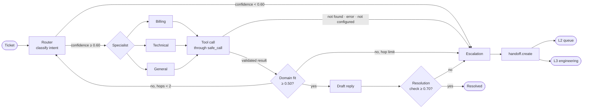
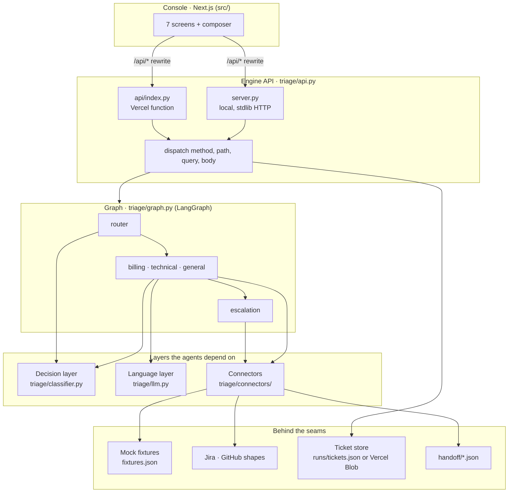
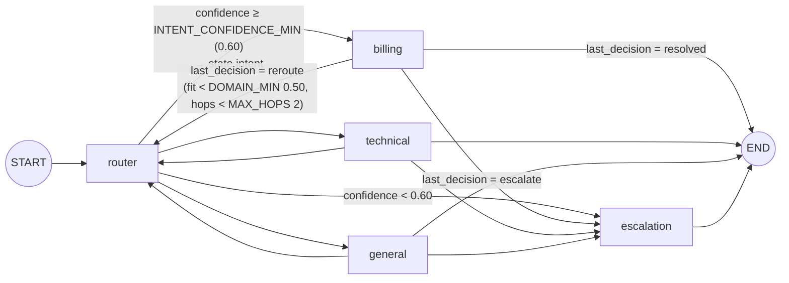
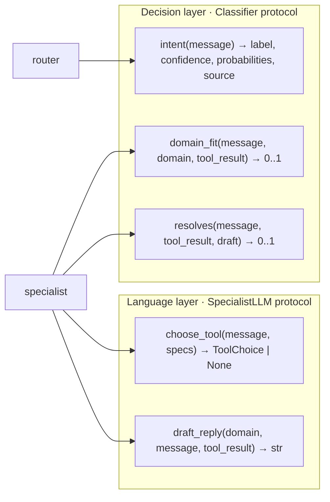
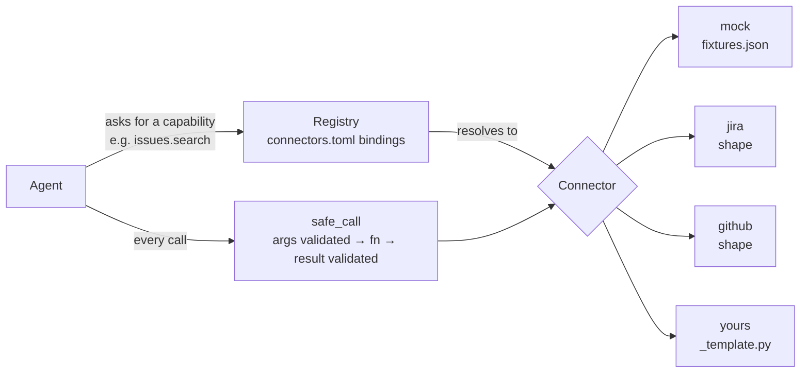
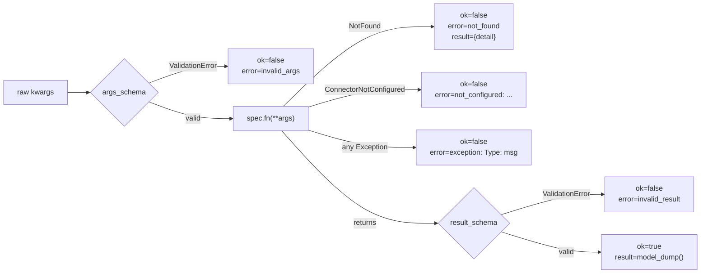
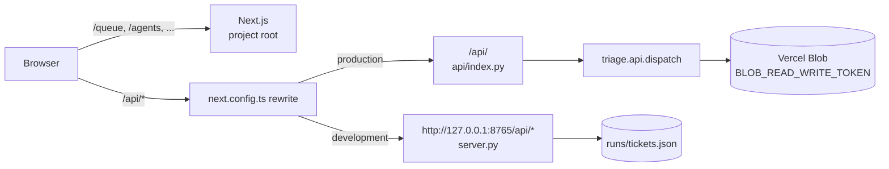

# Multi-agent ticket triage

A support message arrives. A router classifies it, one of three specialist agents looks up the facts through a tool call, two checks decide whether the answer can be sent, and anything that fails a check is handed to a person with the complete history attached. The graph is LangGraph; every routing decision is a conditional edge, not a prompt. Around the graph sit a connector layer (agents ask for a capability, configuration decides which system serves it), a decision layer with calibrated probabilities behind a protocol, a JSON API, a durable ticket store, and an L2/L3 support-desk console. The whole thing runs with no API keys on deterministic stubs, which is also what the tests use.

| | |
| --- | --- |
| Engine | Python 3.11+, LangGraph 1.x, LangChain Core, Pydantic 2 |
| Console | Next.js 16, React 19, TypeScript, Tailwind 4 |
| Tests | 22, offline, under one second |
| Eval | `python run.py --eval` scores any configured model per step on a fixed labelled set; CI enforces the baseline floor |
| Screens | 7 in the sidebar, plus a ticket detail page |
| API | 10 endpoints, standard library only |
| Live console (optional) | https://multi-agent-ticket-triage.vercel.app — one Vercel project: Next.js at the root, Python function at `api/index.py` |
| Keys required | None |

## Scope

The brief's deliverable is the engine: `triage/` (graph, agents, connectors, decision layer), `run.py`, `tests/` and `samples/`. Everything else — the JSON API, the console and the Vercel deployment — is additive. It shares no code with the graph, no test the brief asks for depends on it, and it exists so a reviewer can watch routing decisions and failure paths happen instead of reading logs. Remove `src/`, `api/` and `server.py` and the deliverable is intact. The brief also asks which model was used and why; the answer is under [Which model, and why](#which-model-and-why), and the evidence is the [evaluation log](samples/eval.md).

## Quick start

| Goal | Commands | What you get |
| --- | --- | --- |
| Engine and CLI only | `python3.11 -m venv .venv && . .venv/bin/activate`<br>`pip install -e ".[dev]"`<br>`python run.py "I was charged twice for invoice INV-1002"`<br>`python run.py --file samples/tickets.txt`<br>`python run.py --summary` | One ticket through the graph with its trail printed; all eight sample tickets; the evaluation summary over `runs/runs.jsonl` |
| Engine and console | `./dev.sh` | Creates `.venv` and installs `node_modules` if missing, starts the engine on `:8765` (seeding 80 tickets through the real graph on first run) and the console on `:3000`. Ctrl-C stops both |
| Tests | `. .venv/bin/activate && pytest -q` | 22 tests against the stub classifier, stub language model and mock connectors |

The engine alone can also be started with `python server.py`; the console alone with `pnpm dev`. Optional providers are switched on by environment variables listed in `.env.example`; with none set, decisions come from keyword rules and replies from templates.

## What it does



The eight tickets in `samples/tickets.txt` cover every branch of that diagram. `samples/all_runs.md` holds the captured output of all eight; four of them also have their own file in `samples/`.

| # | Ticket | Path exercised | Outcome |
| --- | --- | --- | --- |
| 1 | I was charged twice for invoice INV-1002 | router → billing → `lookup_invoice` → fit 1.00 → draft → check 0.90 | Resolved: refund of the duplicate is due |
| 2 | The app crashes with an error every time I export to CSV | router → technical → model chooses `check_known_issue` → fit 1.00 → check 0.90 | Resolved: known issue KI-203, no workaround yet |
| 3 | What are your support hours? | router → general → `search_kb` → fit 1.00 → check 0.90 | Resolved: 08:00 to 20:00 UK time |
| 4 | Invoice INV-1002 opens but the page crashes with an error every time | router → billing → `lookup_invoice` → fit 0.33 → hand to technical → router honours handoff → technical → `check_known_issue` → fit 0.67 → check 0.90 | Resolved after a misroute: KI-201 with workaround |
| 5 | asdf qwerty zxcv | router: confidence 0.34 < 0.60 | Escalated: low routing confidence, no specialist visited |
| 6 | Please refund invoice INV-0000, it was a mistake | router → billing → `lookup_invoice` → `not_found` | Escalated: lookup found nothing, human to confirm the id |
| 7 | My account ACC-9999 shows the wrong plan and I was billed for it | router → billing → `get_account_status` raises `ConnectionError` | Escalated: tool failed, contained, not guessing |
| 8 | You billed me twice this month and I want a refund | router → billing → no INV- or ACC- id in the message | Escalated before any lookup: needs an identifier |

## Architecture



| Layer | Module | Reads | Writes | Why it is separate |
| --- | --- | --- | --- | --- |
| Console | `src/app`, `src/components`, `src/lib` | `/api/*` JSON | `POST /api/tickets`, `POST .../reprocess`, `PUT /api/connectors/{cap}`, `PUT /api/settings` | A desk console is how the system would be operated; the engine has no dependency on it |
| Engine API | `triage/api.py` | Store, registry, config | Store, registry bindings, config thresholds | One `dispatch()` knows the endpoints; both HTTP adapters are under 60 lines |
| HTTP adapters | `server.py`, `api/index.py` | HTTP request | HTTP response | Local development and Vercel differ only in transport |
| Graph | `triage/graph.py` | `TicketState` | `TicketState` via reducers | All control flow in one file; nodes never decide where a ticket goes next |
| Agents | `triage/agents/` | State, classifier, LLM, registry | Partial state updates | One specialist skeleton (`common.py`) with three configurations |
| Decision layer | `triage/classifier.py` | Message, tool result, draft | Labels and probabilities | Thresholds should be driven by calibrated numbers, so decisions are a classification service, not a prompt |
| Language layer | `triage/llm.py` | Message, tool specs, tool result | A tool choice, a draft reply | The only two things a generative model is asked to do |
| Connectors | `triage/connectors/` | Capability name | Validated `ToolCall` | Agents are written against result schemas in `base.py`, not against any system |
| Store | `triage/store.py`, `triage/persistence.py` | Backend document | Backend document | Desk metadata (lane, priority, SLA) is layered on the graph's final state, not mixed into it |
| Logging | `triage/logging.py` | Final state | `runs/runs.jsonl` | The evaluation hook is a flat file any tool can read |

## The graph



`build_graph()` in `triage/graph.py` adds five nodes and two conditional-edge functions. `route_after_router` returns `"escalation"` when `confidence < INTENT_CONFIDENCE_MIN`, otherwise the intent label. `route_after_specialist` maps `last_decision` to `__end__`, `router` or `escalation`. When a specialist sets `reroute_to`, the router honours it with confidence 1.0 instead of reclassifying, so a handoff cannot loop back through the same guess. Thresholds live in `triage/config.py` and are read at call time, which is why the Settings screen can change them without a restart.

All three specialists are `make_specialist()` in `triage/agents/common.py`, configured by a `Specialist` dataclass (domain, capabilities in preference order, mode, extractor, missing hint).

| Step | What happens | Failure path it can trigger |
| --- | --- | --- |
| 1 | Append `picked up ticket (hop n)` to the trail, add the domain to `route_history`, increment `hops` | None |
| 2 | Decide what to look up. Direct mode (`billing`, `general`) runs an extractor over the message. LLM mode (`technical`) binds the tool specs to the model and asks it to choose one call | No identifier extracted → escalate with the missing hint. Model chooses no tool → escalate |
| 3 | Call the chosen tool through `safe_call`; record the `ToolCall` in state | None here; every exception is contained by `safe_call` |
| 4 | Inspect `ok` and `error` | `not_found` → escalate asking a human to confirm the id. Any other error → escalate as tool failed, not guessing |
| 5 | Score `domain_fit` for this domain and the other two, now that facts exist | Fit below `DOMAIN_MIN`: if the next hop would reach `MAX_HOPS`, escalate as a possible routing loop; otherwise set `reroute_to` and hand back |
| 6 | Draft a reply from the validated result, then score `resolves` | Score below `RESOLUTION_MIN` → discard the draft and escalate |
| 7 | Set `status = resolved` and `resolution` | None |

## State

`TicketState` in `triage/state.py` is a `TypedDict`. The three list fields carry an `operator.add` reducer, so a node returns only what it appends and LangGraph merges it. That is what makes `trail` a record of every attempt rather than the last node's opinion.

| Field | Type | Written by | A reviewer uses it to |
| --- | --- | --- | --- |
| `ticket_id` | `str` | `new_ticket()` | Find the handoff file and the run record |
| `message` | `str` | `new_ticket()` | Read what the customer said |
| `intent` | `"billing" \| "technical" \| "general" \| "unknown"` | router | See where the router sent it, or what a specialist recommended |
| `confidence` | `float` | router | Compare against `INTENT_CONFIDENCE_MIN`; 1.0 on an honoured handoff |
| `intent_probs` | `dict[str, float]` | router | See the full distribution, not only the winner |
| `intent_source` | `"jev" \| "llm" \| "stub"` | router | Know whether the confidence was calibrated, self-reported or rule-based |
| `reroute_to` | `str \| None` | specialist sets, router clears | See a pending handoff recommendation |
| `last_decision` | `"resolved" \| "reroute" \| "escalate" \| ""` | specialist | The value the conditional edge routed on |
| `route_history` | `list[str]` (add) | specialist | Every specialist visited, in order; length > 1 is a misroute |
| `hops` | `int` | specialist | Compare against `MAX_HOPS` |
| `tool_calls` | `list[ToolCall]` (add) | specialist, escalation | Every call: connector, capability, name, args, ok, error, validated result |
| `trail` | `list[str]` (add) | every node | One plain sentence per event, prefixed by the agent that wrote it |
| `status` | `"open" \| "resolved" \| "escalated"` | specialist or escalation | The outcome |
| `resolution` | `str \| None` | specialist | The reply that passed the resolution check |
| `escalation_reason` | `str \| None` | specialist or escalation | Why a person is needed; the console derives "what to do next" from it |
| `handoff_ref` | `str \| None` | escalation | The receipt from `handoff.create` |

The ticket store (`triage/store.py`) keeps the final state unchanged and adds desk metadata beside it: `customer`, `company`, `channel`, `priority`, `created_at`, `latency_ms`, `lane` (`auto`, `L2` or `L3`, derived from the escalation reason), `sla_due`, `sla_breached` and `assignee`.

## Decisions vs language



Routing is a classification problem: three options, one answer, and a threshold that decides whether a person gets involved. A threshold is only meaningful if the number it compares against is calibrated. Asking a generative model "how confident are you" produces a number the model wrote, not a probability derived from a distribution. So the graph separates the two kinds of work. Every yes/no and which-of-these question goes to a `Classifier`; the generative model is asked only to pick a tool call and to write a reply from validated facts. The trail records the source (`router[jev]`, `router[llm]`, `router[stub]`) so a reviewer knows which kind of confidence drove each decision.

| Classifier | Selected when | What its confidence means |
| --- | --- | --- |
| `JevClassifier` | `TYPESAFE_API_KEY` is set and `langchain-typesafe` is installed (`pip install -e ".[jev]"`) | Calibrated. Jev is a fast classifier rather than a generative model; it returns a probability per option and a confidence derived from that distribution. `domain_fit` and `resolves` are Noul questions returning a probability |
| `LLMClassifier` | No Jev, but `LLM_MODEL` is set | Self-reported. Structured output from the chat model with a `confidence` field the model fills in. Weaker, and labelled as such in the trail |
| `StubClassifier` | Default, and every test | Rule-based. `intent` uses the first domain keyword in the message; `domain_fit` uses the share of all domain keywords. The two disagree on purpose, which is how sample ticket 4 misroutes and corrects itself from the data rather than from a special case |

| Language model | Selected when | What it does |
| --- | --- | --- |
| `ChatModelLLM` | `LLM_MODEL` is set to any LangChain model string (`openai:gpt-4o-mini`, `ollama:llama3.2`, `google_genai:gemini-2.0-flash`); the provider package is installed and its usual key variable is set | `init_chat_model(spec, temperature=0)`. `choose_tool` binds the connector's `ToolSpec`s as LangChain tools and takes the first tool call; `draft_reply` writes from the lookup only |
| `StubLLM` | `LLM_MODEL` unset | Picks the first tool whose arguments it can fill from the message; drafts a templated reply from the validated result |

Selection is by environment at start-up (`make_classifier`, `make_llm`), so a running desk cannot silently switch models. The Settings screen shows the active providers read-only.

### Which model, and why

The system is model-agnostic by design. `LLM_MODEL` accepts any LangChain provider string and `init_chat_model` builds it (`triage/llm.py`); decisions go through the `Classifier` protocol. The model is configuration, not code, and no vendor SDK is imported anywhere in `triage/`.

Which model to run is therefore an evaluation result, not a preference. `python run.py --eval` scores whatever is configured on the fixed labelled set, step by step, and `--record` appends the row to [`samples/eval.md`](samples/eval.md). The stub row is the baseline: it needs no key, every test runs against it, and CI holds it at 1.00 on every step so the graph's seams cannot regress unnoticed. A candidate model earns its row the same way and is judged on the written floors, never on one number. The calibrated Jev classifier (`JevClassifier`) is wired for the same reason — a threshold only means what it says against a calibrated probability — and is switched on by `TYPESAFE_API_KEY`.

## Connectors



Agents never name a connector. `triage/connectors/registry.py` reads `connectors.toml`, registers every known connector, and resolves a capability to a `ToolSpec`. Result and argument schemas live in `triage/connectors/base.py`, so an agent's contract is fixed regardless of what serves it. A connector that returns the wrong shape fails validation in `safe_call` before an agent sees it.

| Capability | Args schema | Result schema | Used by | Served by |
| --- | --- | --- | --- | --- |
| `account.lookup` | `AccountArgs {account_id}` | `AccountStatus {account_id, plan, status, balance_due, currency}` | billing | mock |
| `invoice.lookup` | `InvoiceArgs {invoice_id}` | `Invoice {invoice_id, account_id, amount, currency, status, charges}` | billing | mock |
| `issues.search` | `SearchArgs {query, min 2 chars}` | `IssueSearchResult {query, matches: [KnownIssue]}` | technical | mock; shapes for jira, github |
| `kb.search` | `SearchArgs {query}` | `KBSearchResult {query, matches: [KBArticle]}` | general | mock |
| `handoff.create` | `HandoffArgs {ticket_id, reason, payload}` | `HandoffReceipt {reference, location}` | escalation | mock (writes `handoff/<id>.json`); shape for jira |

The mock fixtures are deliberately awkward: `ACC-9999` raises `ConnectionError`, and any unknown id raises `NotFound`. Both are failure paths the graph has to survive.

Adding a connector, from `triage/connectors/_template.py` and `triage/connectors/README.md`:

1. Copy `_template.py` to `<name>.py` and rename the class; set `name`, which is what `connectors.toml` refers to.
2. Declare `capabilities` from `Cap`. Declare only what you implement.
3. Write one function per capability. Take arguments from the matching args schema, return a dict or model matching the result schema. Raise `NotFound` for a clean miss; let real errors raise.
4. Return a `ToolSpec` per capability from `tools()`.
5. Bind it in `connectors.toml`, or rebind live from the Connectors screen.
6. Run `pytest tests/test_connectors.py`. `test_custom_connector_plugs_in_and_the_agent_uses_it` registers a throwaway connector and proves the technical agent uses it without any agent code changing; copy it for yours.

`jira.py` and `github.py` are shapes. The brief puts live integrations out of scope, so each file shows exactly where a live call goes: the class, the capabilities it serves, the tool signatures, the credentials it reads (`JIRA_BASE_URL`, `JIRA_EMAIL`, `JIRA_API_TOKEN`; `GITHUB_REPO`, optional `GITHUB_TOKEN`), and a comment naming the HTTP call (`GET /rest/api/3/search`, `POST /rest/api/3/issue`, `GET /search/issues?q=...+repo:...`). Until the variables are set, every tool raises `ConnectorNotConfigured`, `safe_call` turns that into `error = "not_configured: set ..."`, and the specialist escalates with that text in the trail. A misconfigured deployment therefore fails loudly and lands in L3.

## Failure handling

| Failure | Trigger | Caught where | State records | Lands in |
| --- | --- | --- | --- | --- |
| Low routing confidence | `confidence < 0.60` | `route_after_router` edge | `route_history = []`, reason `low routing confidence` | L2 |
| No identifier in the message | Direct-mode extractor returns `None` | Specialist step 2 | No lookup in `tool_calls`; reason `needs an invoice id (INV-…) or account id (ACC-…) ...` | L2 |
| Model chooses no tool | LLM-mode `choose_tool` returns `None` | Specialist step 2 | Reason `could not determine what to look up; needs ...` | L2 |
| Record does not exist | Connector raises `NotFound` | `safe_call` → step 4 | `ToolCall.error = "not_found"`, reason `lookup found nothing for {...}` | L2 |
| Backend throws | Connector raises any other exception | `safe_call` → step 4 | `error = "exception: ConnectionError: ..."`, reason `tool failed (...); not guessing` | L3 |
| Real connector unconfigured | Connector raises `ConnectorNotConfigured` | `safe_call` → step 4 | `error = "not_configured: set JIRA_BASE_URL, ..."`, reason `tool failed (...)` | L3 |
| Bad arguments | Args fail the Pydantic schema (for example a one-character query) | `safe_call`, before `fn` runs | `error = "invalid_args: ..."`, reason `tool failed (...)` | L3 |
| Malformed result | Result fails the result schema | `safe_call`, after `fn` | `error = "invalid_result: ..."`, reason `tool failed (...)` | L3 |
| Routing loop | Fit below `DOMAIN_MIN` when the next hop would reach `MAX_HOPS` | Specialist step 5 | Reason `looks like X but hop limit 2 reached; possible routing loop` | L3 |
| Weak draft | `resolves` score below `RESOLUTION_MIN` | Specialist step 6 | Draft discarded, `resolution = None`, reason `draft did not confidently resolve the ticket (0.10 < 0.70)` | L2 |

Lane assignment is `_lane()` in `triage/store.py`: reasons containing `tool failed`, `routing loop`, `hop limit` or `not_configured` go to L3 (engineering); every other escalation goes to L2. Every escalation ends in the `escalation` node, which calls `handoff.create` with the message, intent, confidence, route history, tool calls and full trail, and records the receipt in `handoff_ref`. An unbound capability raises `CapabilityUnavailable` from the registry at node entry; that is a configuration error surfaced at first use, not a runtime path, and `safe_call` does not contain it.

### safe_call

`triage/connectors/safe_call.py` is the boundary every tool invocation crosses.



An agent only ever sees a `ToolCall` with `ok = true` and a validated result, or `ok = false` and an error string it can route on. Tests `test_safe_call_rejects_bad_arguments`, `test_safe_call_rejects_a_malformed_result` and `test_tool_exception_is_contained_and_escalates` cover the three edges.

## The console

The console is an L2/L3 support desk over the same graph. Every screen reads from the engine API; nothing is rendered from static data. A composer is pinned to the bottom of every screen: paste a customer message, choose a channel and priority, press Enter, and the ticket runs through the graph immediately and opens on its detail page.

| Screen | Route | The question it answers | Key elements |
| --- | --- | --- | --- |
| Command centre | `/` | What needs a person right now, and how is the orchestrator doing | Six KPI tiles (tickets, auto-resolution, open L2, open L3, SLA breached, mean handle time), throughput per day, escalated-and-waiting list, routing health, escalation reasons, live feed |
| Queue | `/queue` | Every ticket, every lane | Lane tabs (All, Auto-resolved, L2, L3) with counts, filters by status, intent, priority, channel and free text, sortable table, route chips showing the path each ticket took |
| Ticket detail | `/queue/[id]` | What happened to this ticket, and what should a human do | Header with lane, priority, SLA and Reprocess; customer message; journey strip with handoffs marked; timeline of every trail line; three gauges (routing confidence, domain fit, resolution check) against the live thresholds; outcome with a derived next step and owner; tool calls with validated results; raw persisted state |
| Orchestrator | `/orchestrator` | Watch a ticket move through the agents | Live routing topology with cumulative edge counts, step-by-step replay of any recent ticket's trail across the graph, per-specialist resolved / escalated / handed-back counts |
| Agents | `/agents` | Who does what, and how well | One card per graph node with its mode (direct extraction or LLM tool calling), capabilities, load and resolution rate from real tickets; the seven-step specialist skeleton |
| Connectors | `/connectors` | Which system serves which capability | Bindings table with health and which agents use each capability, an agents → capabilities → connectors map, and the six-step add-a-connector guide |
| Analytics | `/analytics` | Is the orchestrator getting better, and where does it fail | Resolution split donut, auto-resolution trend by day, intent and channel breakdowns, escalation reasons, tool reliability (ok versus failed per tool) |
| Settings | `/settings` | Where does the graph stop trusting itself | Sliders for the three thresholds and a selector for max hops, saved to the engine; active decision and language providers, read-only |

Three actions are live against the engine: Reprocess on a ticket (runs the same message again under the current settings and connectors), rebinding a capability on the Connectors screen (`PUT /api/connectors/{cap}`, takes effect on the next ticket), and saving thresholds on the Settings screen (`PUT /api/settings`, takes effect on the next ticket). The Assign to L2, Assign to L3 and Close buttons on the ticket header, and the SLA policy and lane selectors on Settings, are display-only and say so. When the engine is unreachable a banner across the top of every screen says so and names the command to start it.

## API

`triage/api.py` exposes one `dispatch(method, path, query, body)` function. `server.py` serves it locally on `127.0.0.1:8765` with CORS headers; `api/index.py` serves it on Vercel.

| Method | Path | Body | Returns |
| --- | --- | --- | --- |
| GET | `/api/meta` | | Decision source, language provider, thresholds, agents, connector bindings, seed count |
| GET | `/api/tickets` | | Ticket list; filter with `status`, `intent`, `lane`, `priority`, `channel`, `q` |
| GET | `/api/tickets/{id}` | | One ticket with its full trail and tool calls, or 404 |
| POST | `/api/tickets` | `{message, customer?, company?, channel?, priority?}` | Runs the graph; 201 with the stored ticket, 400 without a message |
| POST | `/api/tickets/{id}/reprocess` | | Runs the same message again under the current settings; the ticket is replaced in place |
| GET | `/api/stats` | | Totals, lanes, auto-resolution rate, SLA breaches, seven-day series, per-tool ok/failed, agent load, misroutes, escalation reasons |
| GET | `/api/connectors` | | Capability → connector, health, and the connectors that could serve it |
| PUT | `/api/connectors/{cap}` | `{connector}` | Rebinds at runtime; 400 for an unknown capability |
| GET | `/api/settings` | | The four thresholds |
| PUT | `/api/settings` | Partial `{intent_confidence_min?, domain_min?, resolution_min?, max_hops?}` | Updated thresholds |

```bash
curl -s localhost:8765/api/meta
curl -s localhost:8765/api/stats
curl -s -X POST localhost:8765/api/tickets -H 'content-type: application/json' -d '{"message":"What are your support hours?"}'
```

The store seeds 80 tickets on first start by running templated messages through the real graph with a fixed random seed, so every environment starts with the same history and every seeded ticket has a genuine trail.

## Evaluation

### The run log

`run.py` appends one JSON line per run to `runs/runs.jsonl` (`triage/logging.py`). `runs/example.jsonl` is a committed example.

| Field | Content |
| --- | --- |
| `ticket_id` | The id printed in the run |
| `intent`, `confidence`, `intent_source` | The router's label, its confidence to three decimals, and which classifier produced it |
| `route_history` | Every specialist visited, in order |
| `tools_called` | `{name, connector, ok, error}` per call, including the handoff |
| `status` | `resolved` or `escalated` |
| `escalation_reason` | The reason text, or null |
| `latency_ms` | Wall-clock time for `app.invoke` |

`python run.py --summary` reads the file back and prints run count, status split, intent split, tool call counts and mean and maximum latency. The console does not read this file; its Analytics screen computes the same categories (status split, intent split, per-tool ok/failed, latency) from the ticket store through `GET /api/stats`, which also buckets free-text escalation reasons into `tool error`, `not found`, `low confidence`, `missing info`, `routing loop`, `weak draft` and `other`.

### Scoring the chain, not the model

A ticket passes through four decisions — intent, tool, arguments, outcome — and a review that signs them off one at a time never sees the number that matters: their product. Five steps at 85% each is a 44% system. `triage/eval.py` scores each step on the fixed labelled set (`samples/labelled.jsonl`: eight tickets with expected intent, tool, arguments and status), multiplies them into a **system** number shown beside the best step, and separately counts **confident-wrong**: tickets that resolved when the label says escalate, or resolved under the wrong intent — the failure that logs itself as success, and the count to read first.

```text
python run.py --eval [--record] [--floor routing=1 --floor confident_wrong=0 ...]
```

| Output | Meaning |
| --- | --- |
| `routing`, `tool`, `args`, `outcome` | Per-step accuracy on the set |
| `system` | Product of the four; a ticket's chance of passing every step |
| `confident-wrong` | Count and ids of resolved-but-should-not-have |
| `escalations`, `p95 ms` | Escalation share and 95th-percentile latency — the tail, not the mean |
| `set` | Hash of the labelled file, so a row always says which set it was scored on and a changed set is never silently compared |

`--record` appends the row to [`samples/eval.md`](samples/eval.md), which also holds the column definitions and the floors. `--floor` turns the run into a gate: CI runs the stub baseline with every step floored at 1.00 and confident-wrong at 0 on every push, so the deterministic path is a regression check on the graph itself, not a flaky model test.

The gates inside the graph are the same idea applied at the seams: the domain-fit check runs after the tool call and before the draft, the resolution check runs before anything is sent, and each has a threshold a person can read. Checks between steps, not only at the end.

### If I had more time, I would

| Change | Why |
| --- | --- |
| Make the human gate the teacher | Every ticket an L2 operator corrects — wrong intent, wrong tool, should not have resolved — becomes a new labelled case, captured in the console at the moment of correction. The gate stops being a brake and becomes the source of the eval set |
| Score the seams, not the agents | Each handoff (router → specialist, specialist → specialist, specialist → escalation) gets its own labelled sub-set and its own row, because a chain fails at handoffs while every part passes on its own |
| Watch the slope, not the number | Re-run the fixed set weekly against the same model and plot each step over time. A drop is investigated in order: how it was measured, what it measured, then the model — most regressions are a measurement change |
| Evaluate the evaluator | The resolution gate uses a model as a judge under `llm` decisions; a small human-labelled set re-run whenever the judge prompt or model changes, so the judge's drift is measured rather than assumed |
| Calibrate the thresholds per model | 0.60 / 0.50 / 0.70 are hand-picked. A few hundred labelled tickets and a sweep give precision and escalation rate at each value, and the chosen thresholds become columns in the eval row |
| Write down what each agent must refuse | A negative set per specialist — tickets it must hand back — scored beside the positive one, so tool scoping is measured, not documented |
| Name an owner per metric | An owner column in the eval log: one person, not a team, who answers when a number moves |
| Adopt a model only after all of the above | Never on the mean, never on one run |

And outside evaluation: route all three specialists through model tool calling once a reference model is measured (direct extraction was chosen for determinism before any model had run); one document per ticket instead of one whole document; a checkpointer so an escalated ticket pauses and resumes; the console last.

## Tests

`pytest -q` runs 22 tests against `StubClassifier`, `StubLLM` and the mock connectors, with handoff files redirected to a temporary directory. `make_app(**overrides)` in `tests/conftest.py` builds a graph whose classifier returns forced values, so the resolution gate and hop limit can be tested without special-casing the rules.

Graph paths, `tests/test_graph.py`:

| Test | What it proves |
| --- | --- |
| `test_billing_resolves` | Billing extracts INV-1002, calls `lookup_invoice`, and the reply mentions a refund |
| `test_technical_resolves_via_llm_tool_calling` | Technical asks the model for a tool call, `check_known_issue` runs, the reply names KI-203 not KI-201 |
| `test_general_resolves` | General searches the knowledge base and the reply carries the support hours |
| `test_misroute_then_correct_route` | Route is `billing → technical`, two tool calls, the trail shows the handoff and the router honouring it |
| `test_low_confidence_escalates_without_visiting_a_specialist` | `route_history` is empty and the reason is low routing confidence |
| `test_tool_not_found_escalates` | The tool call carries `error = "not_found"` and the reason says found nothing |
| `test_tool_exception_is_contained_and_escalates` | The tool call carries `error` starting `exception:` and the reason says not guessing |
| `test_missing_identifier_escalates_before_calling_anything` | The only tool call is `create_handoff`; the reason asks for an invoice id |
| `test_resolution_gate_blocks_a_weak_draft` | With `resolves = 0.1` the ticket escalates even though the lookup succeeded |
| `test_hop_limit_stops_a_routing_loop` | With `domain_fit = 0.0` every specialist disowns the ticket; it escalates after exactly `MAX_HOPS` visits |
| `test_trail_records_every_step_for_a_human` | The misroute trail contains the router source, both pickups, both tool calls, the fit line, the handoff and the resolution |

Connectors, `tests/test_connectors.py`:

| Test | What it proves |
| --- | --- |
| `test_registry_resolves_by_capability` | `invoice.lookup` resolves to `mock` and the `lookup_invoice` spec |
| `test_unbound_capability_fails_loudly` | An empty registry raises `CapabilityUnavailable` |
| `test_safe_call_rejects_a_malformed_result` | A connector returning the wrong shape yields `error = "invalid_result: ..."` |
| `test_safe_call_rejects_bad_arguments` | A one-character query fails `SearchArgs` and yields `error = "invalid_args: ..."` |
| `test_real_connector_shapes_report_not_configured` | Binding `issues.search` to `jira` without credentials yields `error = "not_configured: ..."` |
| `test_custom_connector_plugs_in_and_the_agent_uses_it` | A throwaway `AcmeConnector` bound to `issues.search` is used by the technical agent end to end with no agent code changed |

`tests/test_store.py` — the ticket store behind the console

| Test | What it proves |
| --- | --- |
| `test_store_persists_across_instances` | A ticket run on one store instance is loaded by a fresh instance on the same backend |
| `test_refresh_picks_up_another_writer` | Two live stores on one backend: a write on A is visible on B after `refresh()`, and A does not re-read its own write |

`tests/test_eval.py` — the evaluation harness

| Test | What it proves |
| --- | --- |
| `test_stub_baseline_is_a_fixed_point` | The committed labelled set scores 1.00 on every step against the stub, with 0 confident-wrong; this pins `samples/` to the code and is what CI floors |
| `test_wrong_expectation_lowers_the_step_and_the_system` | One mislabelled tool drops tool and argument accuracy to 0.875 each and the system number to 0.766 — lower than any single step |
| `test_resolving_when_told_to_escalate_is_confident_wrong` | A resolve where the label says escalate is counted, named by id, and trips the `confident_wrong` floor |

Every escalation test also asserts the shared invariant: a reason is set, a `HANDOFF-` reference exists, the last tool call is a successful `create_handoff`, and `resolution` is null.

## Deployment



One Vercel project serves both halves. `vercel.json` sets `framework: nextjs`, `installCommand: pnpm install --frozen-lockfile`, and a 30-second `maxDuration` for `api/index.py`. Vercel detects the Python function and installs `requirements.txt` (the three runtime dependencies, kept in sync with `pyproject.toml`). The rewrite in `next.config.ts` sends `/api/:path*` to the local Python server in development and to `/api/` in production; the function receives the original path, so `triage/api.py` routes identically in both. Server components resolve the engine address once in `src/lib/engine.ts`: `NEXT_PUBLIC_ENGINE_URL` if set; on Vercel the production domain (`VERCEL_PROJECT_PRODUCTION_URL`) in production and the deployment URL (`VERCEL_URL`) otherwise; else `127.0.0.1:8765`. The production domain is used deliberately: per-deployment URLs sit behind Deployment Protection, which would answer a server-side fetch with a login page. Preview deployments set `VERCEL_AUTOMATION_BYPASS_SECRET`, which `engine.ts` forwards as `x-vercel-protection-bypass`.

Persistence follows the environment (`triage/persistence.py`): with `BLOB_READ_WRITE_TOKEN` set, which Vercel does when a Blob store is attached, the ticket document lives in Vercel Blob at `triage/tickets.json` and is read and written over the Blob REST API with `urllib`; otherwise it is `runs/tickets.json` on disk. The `Engine` object is built once per process and cached; on Vercel a warm function instance keeps runtime rebinding and threshold changes, a cold start reloads them from code and `connectors.toml`.

A deployed engine runs as several function instances, each with the store in memory, so every `dispatch` begins with `store.refresh()`: the file backend compares the file's mtime, the Blob backend sends a conditional GET with the document's ETag and gets a `304` when nothing changed. A ticket created on one instance is therefore visible to the next request wherever it lands, at the cost of one small round trip. Writes are whole-document and last-writer-wins, which is adequate for a desk of this size and stated as a limitation below.

Continuous integration, `.github/workflows/`:

| Workflow | Trigger | Steps |
| --- | --- | --- |
| `ci.yml` | Every push to `main` and every pull request | Engine job: `pip install -e ".[dev]"`, `pytest -q`, `python run.py --file samples/tickets.txt`. Console job: `pnpm install --frozen-lockfile`, `pnpm typecheck`, `pnpm lint`, `pnpm build` |
| `release.yml` | Push of a tag matching `v*.*.*` | Re-runs the same checks, then publishes a GitHub Release with generated notes. Production deployment itself is Vercel's Git integration on `main`; a release marks what is live |

`CHANGELOG.md` records releases by version.

## Design decisions

| Decision | Alternative considered | Why this one |
| --- | --- | --- |
| Control flow in conditional edges | Let each agent's prompt decide where to send the ticket | Edges are testable, visible in one file, and cannot be talked out of a threshold. A prompt that "usually" escalates is not a failure path |
| One specialist skeleton with three configurations | Three hand-written agents | Identical shape means identical failure handling; a fix in step 4 fixes all three. The differences that matter (capabilities, mode, extractor) are data |
| Two specialists extract identifiers directly, one uses LLM tool calling | All three via tool calling, or none | Direct extraction is deterministic and testable; tool calling is what the brief names. Doing one each way shows both without making the tests depend on a model |
| Capabilities, not connectors | Agents import a client and call it | An agent written against `issues.search` and `IssueSearchResult` does not change when Jira replaces the mock. `test_custom_connector_plugs_in_and_the_agent_uses_it` is the proof |
| Decisions behind a `Classifier` protocol, separate from language | Ask the chat model for a label and a confidence in one call | Thresholds need calibrated numbers. Jev returns probabilities from a distribution; an LLM's confidence is self-reported. The protocol lets the graph run on either, and the trail says which |
| Stubs as the default | Require a key to run | The repository runs and tests with no network. Reviewers see every path in under a second; providers are opt-in by environment |
| Provider-agnostic language layer via `LLM_MODEL` | Hard-code one vendor's SDK | `init_chat_model("provider:model")` covers OpenAI, Ollama, Google and others with the same code; the choice is configuration |
| `safe_call` as the only way to invoke a tool | Try/except in each agent | Validation and containment in one place, so an agent cannot forget it. Arguments, results and exceptions all become a structured `ToolCall` |
| Standard-library engine API | FastAPI or Flask | Zero extra runtime dependencies for the Vercel function, and `dispatch()` is trivially unit-testable. Both adapters are under 60 lines |
| Desk metadata layered on the graph state, not in it | Add lane, priority and SLA to `TicketState` | The graph stays about triage; the store's `enrich()` derives lane from the escalation reason, so the graph never knows what L2 or L3 means |
| Seed through the real graph | Ship a fixture of fake tickets | Every seeded ticket has a real trail, real tool calls and real decisions, so the console never shows a state the graph could not produce |
| Mermaid diagrams in this file | Images | They render on GitHub and diff as text |

## Assumptions and limitations

| Assumption | Where it shows |
| --- | --- |
| Tickets are single-turn; there is no conversation with the customer | A missing identifier escalates rather than asking |
| Thresholds (0.60 route, 0.50 domain fit, 0.70 resolution, 2 hops) are starting points, not calibrated values | `triage/config.py` says so in its docstring |
| The stub classifier's first-keyword router and share-of-keywords domain check are allowed to disagree | That disagreement is what produces the misroute case from the data |
| Identifiers follow `INV-\d+` and `ACC-\d+` | `extract_billing` in `triage/agents/common.py` |
| Live integrations are out of scope | `jira.py` and `github.py` are shapes that raise `ConnectorNotConfigured` |
| Seeded desk metadata (customers, channels, assignees) is synthetic | The Analytics screen says figures illustrate the console, not a production desk |

| Limitation | What would be done next |
| --- | --- |
| Thresholds are uncalibrated | The eval harness is the instrument: label a larger set, sweep each threshold per model, and record precision and escalation rate at each value in `samples/eval.md` before choosing |
| Escalation ends the run | Add a LangGraph checkpointer so the ticket pauses at escalation and resumes from the same state when a person supplies the missing identifier |
| Any tool error escalates immediately | A per-tool retry policy: one retry with backoff for timeouts, none for `not_found` or `invalid_args` |
| GitHub search is a shape | Issue search on a public repository needs no authentication and is about twenty lines with `httpx`; left out so the demo has no network dependency |
| The router sees only the message | Pass account history or prior tickets as `context`; the `Classifier.intent` signature already accepts it |
| Single turn only | Multi-turn would need the conversation in state and a "reply and wait" edge, which is the checkpointer work above |
| Runtime rebinding and threshold changes live in process memory | Persist them beside the tickets so a cold serverless start keeps the desk's settings |
| The ticket document is written whole, last writer wins | Two instances saving in the same instant could drop one ticket. Per-ticket blobs, or a compare-and-swap on the ETag with one retry, would close the window |

## Repository layout

```
.
├── api/
│   └── index.py                  Vercel Python function; adapts HTTP to triage.api.dispatch
├── .github/workflows/
│   ├── ci.yml                    pytest + CLI smoke run; typecheck, lint, build
│   └── release.yml               tagged releases: verify, then publish a GitHub Release
├── handoff/                      escalated tickets written by the mock handoff connector
├── runs/
│   ├── example.jsonl             committed example of the run log
│   ├── runs.jsonl                run log appended by run.py (ignored by git)
│   └── tickets.json              ticket store when no Blob token is set (ignored by git)
├── samples/
│   ├── tickets.txt               eight tickets, one per path
│   ├── labelled.jsonl            the same eight with expected intent, tool, arguments and status
│   ├── eval.md                   evaluation log: column definitions, floors, one row per scored model
│   ├── all_runs.md               captured output of all eight
│   ├── run_billing_resolved.md
│   ├── run_escalation_not_found.md
│   ├── run_escalation_tool_error.md
│   └── run_misroute_then_correct.md
├── src/
│   ├── app/                      Next.js routes: /, queue, queue/[id], orchestrator, agents, connectors, analytics, settings
│   ├── components/               shell (sidebar, composer, engine banner), overview, queue, ticket, orchestrator, agents, connectors, analytics, settings, ui
│   └── lib/                      api.ts (browser client), engine.ts (server-side engine URL), types.ts, semantics.ts
├── tests/
│   ├── conftest.py               stub graph fixtures; handoff redirected to a temp dir
│   ├── test_graph.py             11 graph-path tests
│   ├── test_connectors.py        6 connector tests
│   ├── test_store.py             2 store tests: persistence and cross-instance refresh
│   └── test_eval.py              3 harness tests: baseline fixed point, compounding, confident-wrong
├── triage/
│   ├── agents/
│   │   ├── common.py             the specialist skeleton and route_after_specialist
│   │   ├── router.py             classify, honour handoffs, route_after_router
│   │   ├── billing.py            direct mode: invoice.lookup, account.lookup
│   │   ├── technical.py          LLM tool-calling mode: issues.search
│   │   ├── general.py            direct mode: kb.search
│   │   └── escalation.py         package the trail and call handoff.create
│   ├── connectors/
│   │   ├── base.py               Cap, schemas, ToolSpec, Connector, NotFound, ConnectorNotConfigured
│   │   ├── registry.py           capability → connector resolution from connectors.toml
│   │   ├── safe_call.py          the validation boundary
│   │   ├── mock/                 fixtures.json and one module per capability group
│   │   ├── jira.py               shape only
│   │   ├── github.py             shape only
│   │   ├── _template.py          copy to add a connector
│   │   └── README.md             the six-step guide
│   ├── api.py                    Engine, stats, dispatch
│   ├── classifier.py             Jev, LLM and stub classifiers behind one protocol
│   ├── config.py                 the four thresholds
│   ├── eval.py                   per-step scoring, system product, confident-wrong, floors
│   ├── graph.py                  build_graph: nodes and conditional edges
│   ├── llm.py                    ChatModelLLM and StubLLM behind one protocol
│   ├── logging.py                runs.jsonl record and summary
│   ├── persistence.py            FileBackend and BlobBackend
│   ├── state.py                  TicketState and ToolCall
│   └── store.py                  TicketStore, seeding, lane and SLA derivation
├── connectors.toml               capability bindings
├── dev.sh                        engine on :8765 and console on :3000 with one command
├── next.config.ts                /api/* rewrite
├── run.py                        CLI
├── server.py                     local engine server
├── vercel.json                   Next.js framework, Python function settings
├── requirements.txt              runtime dependencies for the Vercel function
├── pyproject.toml                package, optional extras (llm, jev, dev), pytest config
├── package.json                  console scripts: dev, build, lint, typecheck, dev:all
├── CHANGELOG.md
└── .env.example                  every optional variable, all blank
```
